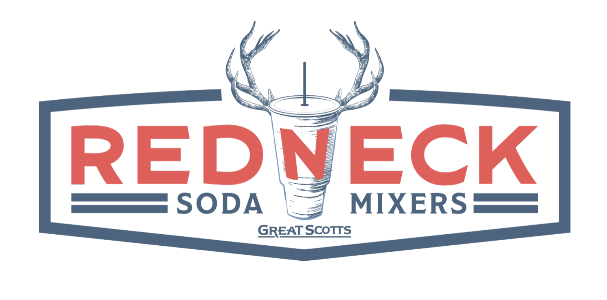

# Redneck Soda Menu

Welcome to the unofficial **Redneck Soda Menu** website! This site was created out of a love for the delicious and unique soda offerings from Redneck Soda in Rexburg, ID. My wife and I often enjoy their drinks but noticed that it was difficult to find an online menu, so we decided to make one ourselves with it hosted in Github Pages.

**Menu**: [ronvallejo.github.io/Redneck-Soda-Menu/](https://ronvallejo.github.io/Redneck-Soda-Menu/)
**Feedback**: [github.com/ronvallejo/Redneck-Soda-Menu/discussions/1](https://github.com/ronvallejo/Redneck-Soda-Menu/discussions/1)

## About This Project

This website is a static, mobile-friendly menu that lists all of the soda options currently available on the menu sign at Redneck Soda. While this site was created from scratch and is designed to be as accurate as possible, please note that it is static—meaning that the information may become outdated over time as the menu changes.

### Key Features:
- **Comprehensive Soda List:** All sodas listed are based on the current menu sign displayed at Redneck Soda.
- **Mobile-Friendly:** The site is optimized for easy viewing and navigation on mobile devices.
- **Simple & Lightweight:** The website is made from scratch using basic HTML, CSS, and JavaScript, ensuring fast load times.

## Usage

Feel free to browse the menu to find your next favorite soda combination. Whether you're a local or just passing through Rexburg, this site is designed to help you quickly see what's available before you head over to Redneck Soda.

## Disclaimer

This website is not affiliated with or endorsed by Redneck Soda. The information provided here is for reference only and may not reflect the most up-to-date menu offerings. We recommend checking directly with Redneck Soda for the latest information.

## Contributions

Since this site is static, it might not always have the latest menu updates. If you're a fan of Redneck Soda and want to contribute by providing updated menu information, feel free to leave feedback on our **[Feedback page](https://github.com/ronvallejo/Redneck-Soda-Menu/discussions/1)**.

## License

This project is open-source and licensed under the MIT License. Feel free to fork the repository, make changes, and use it as you see fit.

---

We hope this site helps you enjoy Redneck Soda as much as we do!
