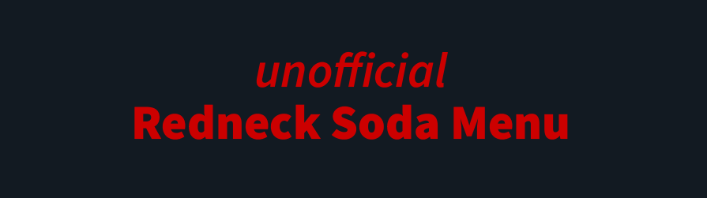

## About

Welcome to the **Official Repository** for the **unofficial Redneck Soda Menu**! The unofficial Redneck Soda Menu was created out of a love for the delicious and unique soda offerings from Redneck Soda in Rexburg, ID. My wife and I often enjoy their drinks but noticed that it was difficult to find an online menu, so we decided to make one ourselves and host on Github Pages.

This website is a semi-static, mobile-friendly menu that lists all of the soda options currently available on the menu sign at Redneck Soda. The application use to build the menu was created using Flask, a lightweight web framework for Python that allows you to build web applications quickly and with minimal overhead. The main file, "app.py" uses Google Sheets API's to fetch the menu items we list from a spreadsheet using Google Sheets. The menu was originally designed with simple HTML, CSS, and JS. But, each time there was a change in the menu, I had to manually update the code. That became old real quick. So I rebuilt the menu in Python using Flask, so I could simply run the script and have it automatically update the webpage. The site is hosted on Github Pages with a custom domain.

> Visit the site [www.unofficialredneckmenu.online](https://unofficialredneckmenu.online/)

### Key Features:
- **Comprehensive Soda List:** All sodas listed are based on the current menu sign displayed at Redneck Soda in Rexburg, ID.
- **Mobile-Friendly:** The site is optimized for easy viewing and navigation on mobile devices using Tailwind CSS.
- **Simple & Lightweight:** The website is built with Flask which outputs simple HTML, CSS, and JavaScript, ensuring fast load times.

## Usage

Feel free to browse the menu to find your next favorite soda combination. Whether you're a local or just passing through Rexburg, this site is designed to help you quickly see what's available before you head over to Redneck Soda.

## Disclaimer

This repository and the site are not affiliated with or endorsed by Redneck Soda. The information provided here is for reference only and may not reflect the most up-to-date menu offerings. We recommend checking directly with Redneck Soda for the latest information.

## Contributions

Since this site is mostly static, it might not always have the latest menu updates. If you're a fan of Redneck Soda and want to contribute by providing updated menu information, feel free to use our feedback form: **[Send us feedback!](https://forms.gle/dLCSiHa66eu9bgfE8)**.

## License

This project is open-source and licensed under the MIT License. Feel free to fork the repository, make changes, and use it as you see fit.

---

We hope this site helps you enjoy Redneck Soda as much as we do!
